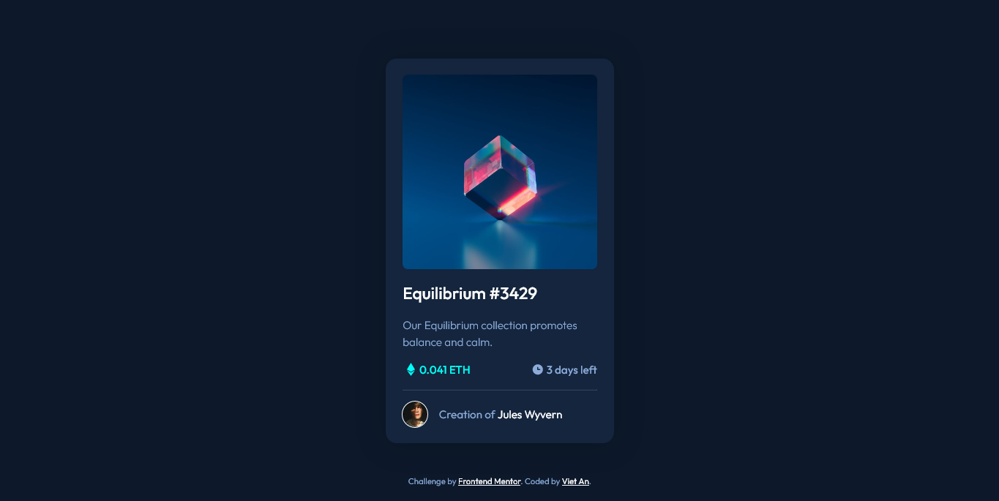

# Frontend Mentor - NFT preview card component solution

This is a solution to the [NFT preview card component challenge on Frontend Mentor](https://www.frontendmentor.io/challenges/nft-preview-card-component-SbdUL_w0U). Frontend Mentor challenges help you improve your coding skills by building realistic projects. 

## Table of contents

- [The challenge](#the-challenge)
- [Screenshot](#screenshot)
- [Links](#links)
- [Built with](#built-with)
- [Author](#author)
- [Acknowledgments](#acknowledgments)
- [Validations](#validations)

## The challenge

Users should be able to:

- View the optimal layout depending on their device's screen size
- See hover states for interactive elements

## Screenshot

## Links

- [Live Website](https://vietan0.github.io/-FM-nft-preview-card-component-main/)
- [Solution Page on Frontend Mentor](https://www.frontendmentor.io/solutions/nft-preview-card-component-using-plain-css-JlGqvCsc8)

## Built with

- Semantic HTML5 markup
- CSS custom properties
- Flexbox
- BEM Naming Convention

## Author

- Frontend Mentor - [@vietan0](https://www.frontendmentor.io/profile/vietan0)
- Linkedin - [@vietan](https://www.linkedin.com/in/vietan/)

## Acknowledgments

I refined my page's accessibility based on feedback from [@PhoenixDev22](https://www.frontendmentor.io/profile/PhoenixDev22). I also learned a few things from [@vanzasetia's solution](https://github.com/vanzasetia/NFT-preview-card-component), including the validation tools below.

## Validations 

- [HTML Validator](https://validator.w3.org/nu/)
- [CSS Validator](https://jigsaw.w3.org/css-validator/)
- [Meta Tags](https://metatags.io/) - Check how my website looks when I share it on Google, Facebook, Twitter and more.
- [Favicon checker](https://realfavicongenerator.net/favicon_checker) - Make sure my favicon looks good on all devices.
- [WAVE Test](https://wave.webaim.org/) - Accessibility tester.
- [PageSpeed Insights](https://developers.google.com/speed/pagespeed/insights/)
- [GTmetrix](https://gtmetrix.com/) - Website speed and performance optimization

[Back to top](#table-of-contents)
